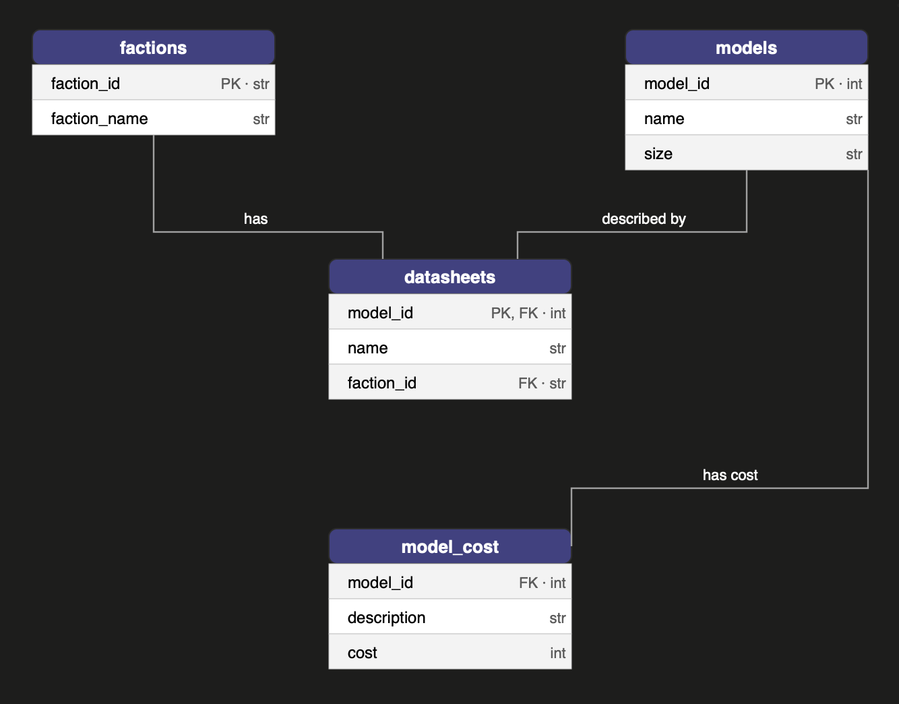

# Warhammer 40K Figurine Budget Guide

## Purpose

This repository explores data from the Warhammer 40,000 universe to analyze the cost of miniature figurines across factions and model sizes. The analysis is intended to identify the most cost-effective faction for new or budget-conscious players entering the hobby. The pipeline integrates data cleaning and database construction in Python, SQL-based querying via DuckDB, and visualization in R.

---

## Repository Contents

```
├── data/                        # Download and place raw CSV files here (see Data Access)
├── outputs/                     # Populated automatically by data_cleaning.ipynb
├── data_cleaning.ipynb          # Python notebook for cleaning and database creation
├── viz.R                        # R script for data visualization
├── queries.sql                  # SQL queries used for analysis
├── wh_database.duckdb           # DuckDB database (generated by data_cleaning.ipynb)
└── README.md
```

---

## Dependencies

### Python
- **Kernel**: Python 3 (base)
- `pandas`
- `duckdb`

### R
- `DBI`
- `duckdb`
- `ggplot2`
- `scales`
- `dplyr`
- `showtext`

Install R packages with:
```r
install.packages(c("DBI", "duckdb", "ggplot2", "scales", "dplyr", "showtext"))
```

---

## Data Access

Data is sourced from Kaggle: [Warhammer 40K Dataset](https://www.kaggle.com/datasets/theredmage/warhammer-40k)

Download the following four tables and place them in the `data/` folder:
- `Wahapedia Data Export - Datasheets.csv`
- `Wahapedia Data Export - Factions.csv`
- `Wahapedia Data Export - DS_Model Costs.csv`
- `Wahapedia Data Export - DS_Models.csv`

---

## Directions for Use

1. Create a folder called `data` in the project root directory
2. Download the four CSV files listed above and place them in the `data/` folder
3. Run `data_cleaning.ipynb` from top to bottom
   - Cleans the raw data, exports parquet files to `outputs/`, and creates `wh_database.duckdb` in the project root
4. Open `viz.R` in RStudio and run the script (`Ctrl+Shift+Enter`)
   - The visualization will render in the RStudio Plots pane

> Note: Run all scripts from the project root directory to ensure relative file paths resolve correctly.

---

## Database Schema


## References

- Wahapedia Warhammer 40K Dataset: https://www.kaggle.com/datasets/theredmage/warhammer-40k
- Class Website: https://ucsb-library-research-data-services.github.io/bren-eds213/

---

## Author

Henry Oliver